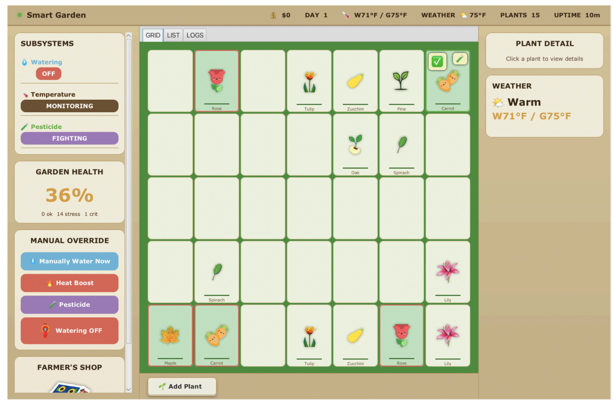
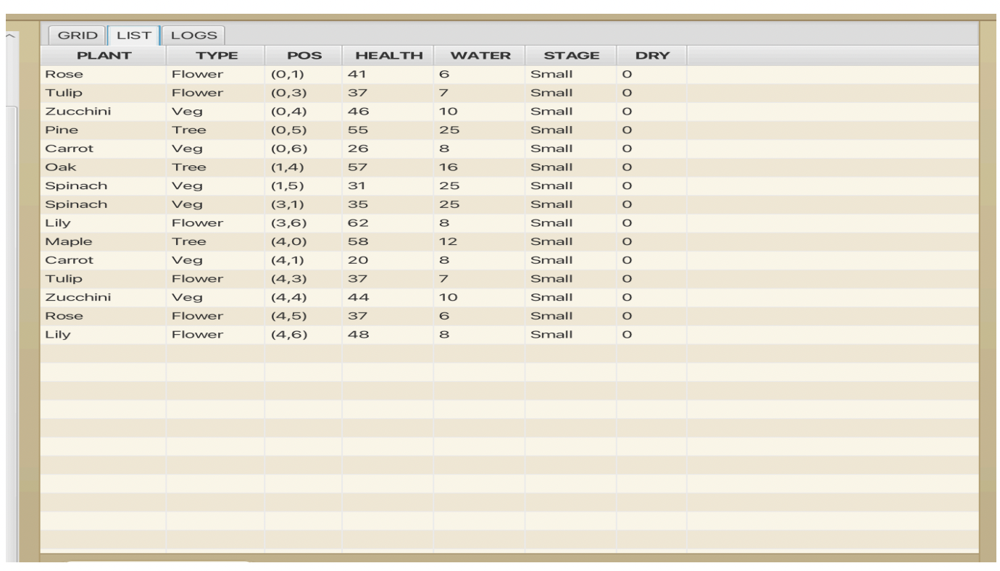
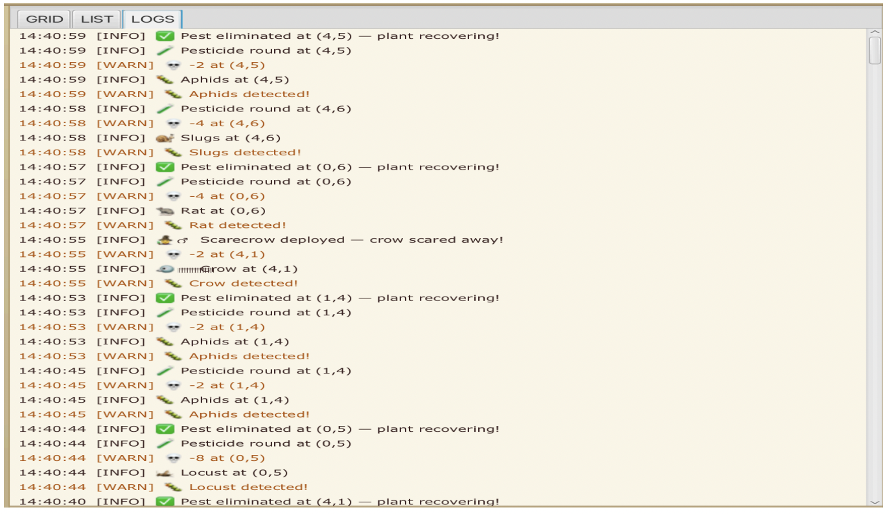
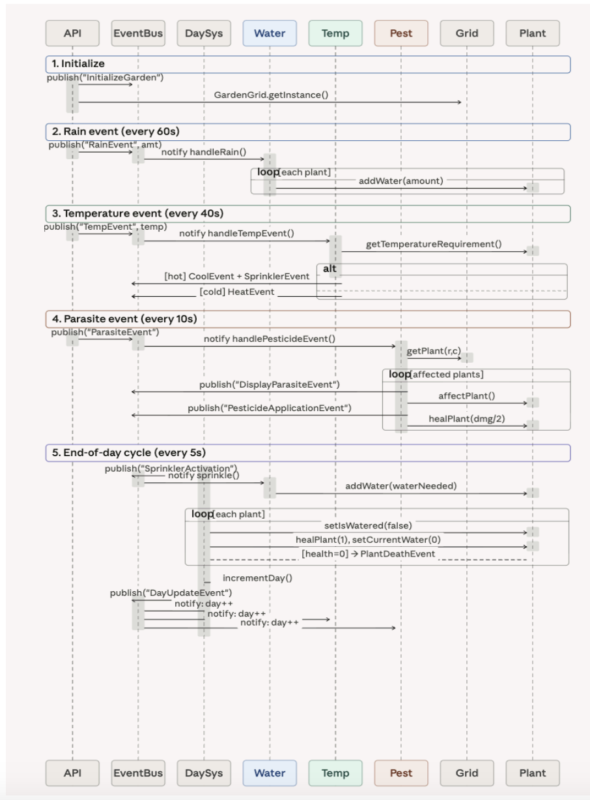

<div align="center">


[](https://openjdk.org/)
[](https://openjfx.io/)
[](https://maven.apache.org/)
[](https://junit.org/junit5/)
[](https://www.scu.edu)

<br/>

> **A fully autonomous, event-driven garden simulation with three concurrent subsystems,**  
> **a live JavaFX dashboard, and a headless scripted API — all sharing one domain model.**

**Team:** Soniya Phaltane · Juhitha Dommaraju · Onkar Bedekar 

</div>

---

## 🌿 What it does

Smart Garden simulates a living 5×7 garden ecosystem with **9 plant species across 3 categories** (Trees, Flowers, Vegetables). Three autonomous subsystems run concurrently on daemon threads — monitoring water, temperature, and pests — without any human intervention. A built-in economy lets harvested crops be sold for revenue to fund equipment repairs.

```
                    ┌─────────────────────────────────────┐
                    │        5×7 Garden Grid (35 cells)    │
                    │  Oak  Rose  Carrot  Pine  Tulip ...  │
                    └────────────────┬────────────────────┘
                                     │  EventBus (pub/sub)
          ┌──────────────────────────┼──────────────────────────┐
          ▼                          ▼                          ▼
  WateringSystem            TemperatureSystem           PesticideSystem
  · ticks every 1s          · checks every 30s          · ticks every 1s
  · auto-waters < 50%       · heater < 55°F             · 3-day pest cycles
  · end-of-day sprinklers   · cooler > 75°F             · 5 pest types
          │                          │                          │
          └──────────────────────────┼──────────────────────────┘
                                     ▼
                         ┌─────────────────────┐
                         │   JavaFX Dashboard   │  ←→  GardenSimulationAPI
                         │  Live grid · alerts  │       (headless mode)
                         └─────────────────────┘
```

---

## ✨ Key Features

| Feature | Details |
|---|---|
| 🌊 **Auto irrigation** | Water consumed per second · auto-sprinklers when plant drops below 50% hydration |
| 🌡 **Climate control** | Greenhouse temp drifts toward outdoor weather · heater/cooler activate automatically |
| 🐛 **Pest management** | 5 pest types · randomized attacks · 3-day pesticide cycles · 2.5-day protection window |
| 🌱 **Full lifecycle** | small → medium → full growth · auto-harvest · economy (sell crops, repair sprinklers) |
| 🖥 **Dual mode** | Interactive JavaFX GUI + headless `GardenSimulationAPI` for scripted testing |
| 📋 **Observability** | 7 log files · timestamped categories · live LOGS tab in UI |
| ⚙️ **JSON config** | All plants, pests, and garden layout loaded from `config/` — no code changes needed |

---
## 📸 Screenshots

**Full Dashboard**


**Plant List View**


**Live Logs**


---
## 🚀 Getting Started

**Requirements:** Java 22 · Maven (or use included `mvnw`)

```bash
# Clone
git clone https://github.com/CosmicMicra/smart_garden.git
cd smart_garden

# Run with JavaFX GUI
mvn javafx:run

# Run headless simulation (no GUI)
mvn exec:java -Dexec.mainClass="com.example.ooad_project.API.GardenSimulationRunner"
```

---

## 🌿 Plant Catalogue

### Vegetables
| Plant | Water Req | Temp Req | Max Health | Vulnerable To |
|---|---|---|---|---|
| Spinach | 10 | 50°F | 90 | Slugs, Aphids |
| Zucchini | 12 | 65°F | 120 | Slugs, Aphids |
| Carrot | 10 | 60°F | 65 | Rats, Slugs |

### Flowers
| Plant | Water Req | Temp Req | Max Health | Vulnerable To |
|---|---|---|---|---|
| Rose | 7 | 65°F | 105 | Aphids |
| Tulip | 8 | 55°F | 105 | Rats, Aphids |
| Lily | 10 | 60°F | 120 | Aphids, Slugs |

### Trees
| Plant | Water Req | Temp Req | Max Health | Vulnerable To |
|---|---|---|---|---|
| Oak | 20 | 65°F | 150 | Aphids |
| Maple | 15 | 60°F | 150 | Aphids |
| Pine | 10 | 50°F | 210 | Locust |

---

## 🐛 Pest System

| Pest | Base Damage | Miss Chance | Rounds to Kill | Targets |
|---|---|---|---|---|
| Aphids | 2 | 10% | 2 | Rose, Oak, Maple |
| Slugs | 4 | 25% | 2 | Carrot, Lily |
| Rat | 4 | 15% | 3 | Carrot |
| Crow | 2 | 20% | scarecrow | Carrot, Spinach, Zucchini |
| Locust | 8 | 5% | 3 | Pine |

> 🪄 **Crow special case:** Scarecrow deploys immediately — no rounds-to-kill tracking, instant scare-off + small plant heal.

---

## 🎨 Design Patterns

| Pattern | Where used |
|---|---|
| **Singleton** | `GardenGrid`, `DaySystem`, `FarmerShop` — one instance per simulation |
| **Observer / EventBus** | All subsystems communicate via pub/sub — zero direct coupling |
| **Factory** | `PlantManager`, `ParasiteFactory` — instantiate species from config |
| **Strategy** | Pluggable pest `affectPlant()` behaviour per pest type |
| **MVC** | FXML views + `GardenUIController` + domain model cleanly separated |

---

## 🏗 Project Structure

```
smart_garden/
├── config/
│   ├── plants.json          # 9 plant species definitions
│   ├── parasites.json       # 5 pest definitions
│   └── garden_config.json   # Grid layout & quantities
├── src/main/java/
│   ├── API/                 # GardenSimulationAPI (headless)
│   ├── subsystems/          # WateringSystem · TempSystem · PesticideSystem
│   ├── domain/              # Plant · GardenGrid · FarmerShop
│   ├── events/              # EventBus + 20+ event types
│   └── ui/                  # GardenUIController + FXML
├── src/main/resources/
│   ├── hello-view.fxml
│   ├── styles/
│   └── images/              # Plant sprites (small/medium/full)
├── logs/                    # Runtime logs (auto-created)
│   ├── garden.log
│   ├── WateringSystem.log
│   ├── TemperatureSystem.log
│   ├── PesticideSystem.log
│   └── ...
└── pom.xml
```
---
## 🔄 Sequence Diagram


---

## 📋 Headless API

```java
SmartGardenAPI api = new SmartGardenAPI();
api.initializeGarden();           // Load from config, place 15 plants
api.rain(42);                     // Trigger rain event, water all plants
api.temperature(95);              // Set outdoor temp, greenhouse drifts
api.parasite("Aphids");           // Trigger pest attack on random target
api.getState();                   // Snapshot: plants alive, health summary
```

Log output format:
```
DAY=1, EVENT=INIT,        EVENT_VALUE=garden_initialized, PLANTS_ALIVE=15
DAY=1, EVENT=RAIN,        EVENT_VALUE=42,                 PLANTS_ALIVE=15
DAY=2, EVENT=TEMPERATURE, EVENT_VALUE=95,                 PLANTS_ALIVE=15
DAY=3, EVENT=PARASITE,    EVENT_VALUE=Aphids,             PLANTS_ALIVE=14
```

---

## 🛠 Tech Stack

<p>
  
</p>

| Dependency | Version | Purpose |
|---|---|---|
| Java SE | 22 | Core language + runtime |
| JavaFX | 22-ea+11 | GUI framework (FXML, Canvas, animations) |
| Apache Maven | 3.x | Build + dependency management |
| org.json | 20240303 | Config JSON parsing |
| Apache Log4j 2 | 2.23.1 | Per-subsystem structured logging |
| JUnit 5 | 5.10.0 | Unit + integration testing |
| Mockito | 5.11.0 | Component isolation in tests |

---

## 👩‍💻 Authors

**Group 3 — CSEN 275, Santa Clara University**

- **Soniya Phaltane** · [@CosmicMicra](https://github.com/CosmicMicra)
- Onkar Bedekar
- Juhitha Dommaraju

*Professor Navid Shaghaghi*

---

<div align="center">
  
</div>
